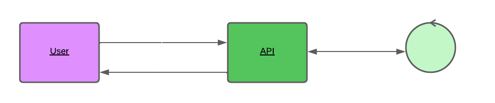

# Api para cadastro de usuários
Um microserviço de autenticação de usuários é fundamental para qualquer aplicação web. Essa API foi contruida com o NodeJS e express em um padrão [REST](https://developer.mozilla.org/pt-BR/docs/Glossary/REST).

## Como Funciona?

    

O usuário ou uma aplicação ao fazer uma requisição para qualquer serviço será solicitado um token de ativação. Caso contrário, se não possuir o token o serviço API indicará o cliente para obter o token ou renová-lo. 

## Instalar localmente
    npm i 
Todas as depêndencias do projeto serão instaladas, sendo assim precisamos cofigurar as variáveis de ambiente. Neste caso, três variáveis são fundamentais:

<ol>
    <li>O localhost onde a API irá rodar;</li>
    <li>O endereço local para o armazenamento no banco de dados mongoDB;</li>
    <li> E as variáveis de autentificação para o token</li>
</ol>

No diretótio do projeto temos um <strong style="color: red;"> .env_exemplo</strong> por padrão, para desenvolvimento a API irá rodar em:

    http://localhost:8080
e no endereço local para o banco de dados MongoDB:

    mongodb://127.0.0.1/nodeJS

É necessário que o NodeJS esteja instalado em sua máquina. E que pelo menos sua maquina tenha acesso a um banco de dados MongoDB. Fica a critério alterar o endereço do banco de dados.

As variáveis de ambiente para validação do token, para o desenvolvimento, também seguem o indicado em <strong style="color: red;"> .env_exemplo</strong>. Caso haja interesse em aprofundar mais sobre o assunto aconselho a leitura da documentação [jsonwebtoken](https://github.com/auth0/node-jsonwebtoken#readme).

## Rodar localmente a API

    npm run dev
Se tudo ocorrer como esperado, será imprimido em seu terminal uma mensagem com o endereço local da API e se obteve sucesso na conecção com o banco de dados;

## Tecnologias usadas
### NodJS: Servidor
* Express: Framework para requisões web;
* body-Parser: manejo com dados vindos do cliente;
* Consign: carregamento de automático de rotas internas;
* cors: compartilhamento de recursos;
* mongoose: ferramenta de modelagem de objetos MongoDB
* yup: construtor de esquemas JavaScript para análise de valor e validação;
* bcryptjs: criptografia de dados;
* jsonwebtoken: é um meio seguro de URL compacto de representar declarações a serem transferidas entre duas partes.

* dotenv: orquestrar as variáveis ambiente;

### Database 
* MongoDB

